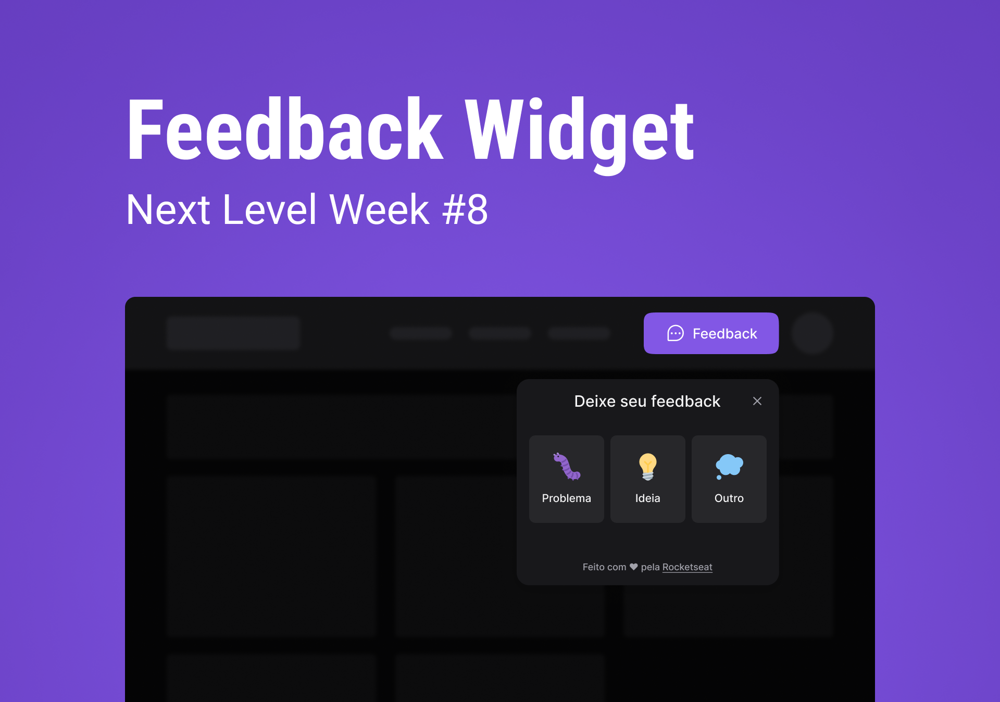

# 💻 Feedback Widget 

Projeto criado para a semana nlw-return da Rocketseat na trilha Impulse

<p align="center">
    
</p>

## 🔧 Tecnologias utilizadas

- ReactJs
- NodeJS
- Express
- Prisma
- Typescript
- TailwindCSS
- Headless UI
- Vite
- Insomnia
- Jest
- NodeMailer
- React native
- Expo

## 📚 Aprendizado

- Pude aprender a utilizar conceitos de acessibilidade com a biblioteca Headless UI e compreender como funciona a estilização das páginas com o TailwindCSS
- Pude aprender princípios do SOLID e aplicá-los no projeto, e por fim criar testes unitários automatizados com o Jest

## 🚀 Como rodar o projeto

- Requerimento: tenha o postgresql configurado ou troque as dependências do db para sqlite 


Clone o repositório e acesse a pasta web

```bash
git clone https://github.com/gabrields03/nlw-feedback-widget
cd nlw-feedback-widget/web
```

Rode esses comandos para instalar as dependências e iniciar o projeto front-end

```bash
npm install
npm run dev
```

Abra um novo terminal <br>
Entre na pasta server e instale suas depedências

```bash
cd nlw-feedback-widget/server
npm install
```

Crie e configure seu arquivo .env conforme o [Prisma](https://www.prisma.io/docs/concepts/database-connectors/sqlite) recomenda 

Rode as migrações do banco de dados

```bash
npx prisma migrate dev
npx prisma generate
```


Rode o back-end do projeto
```bash
npm run dev
```

Para rodar o projeto em produção

```bash
npm run start
```
---

## 📝 License

This project is licensed under the MIT License

---
Feito com ♥ by [Gabriel Souza](https://www.linkedin.com/in/gabriel-souza-98a471208/)

